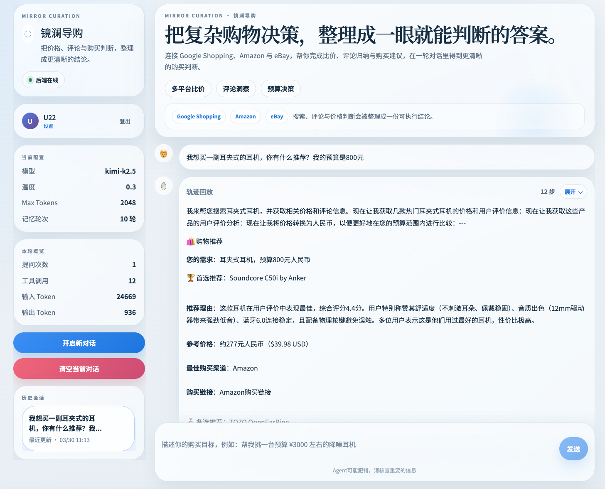

# 镜澜导购 · Sales Agent

> 智能多平台购物决策助手 — 连接 Google Shopping、Amazon 与 eBay，一轮对话完成比价、评论归纳与购买建议。



[](https://www.python.org/)
[](https://fastapi.tiangolo.com/)
[](https://langchain.dev/)
[](https://www.mongodb.com/)
[](https://react.dev/)
[](https://www.typescriptlang.org/)
[](LICENSE)

## 功能特点

- **多平台搜索** — 搜索 Google Shopping、Amazon、eBay
- **智能比价** — 实时获取各平台价格，支持多货币换算
- **评论洞察** — AI 归纳用户评论，提炼优缺点与情感倾向
- **购买推荐** — 综合价格、评分、评论给出结构化建议
- **会话记忆** — MongoDB 持久化记忆，跨重启保持上下文
- **多语言支持** — 中文、英文、日文、韩文

## 工作流

```
用户输入 → 搜索商品 → ┬→ 价格查询 ─┐
                     ├→ 评论分析 ─┼→ 智能推荐 → 输出
                     └→ 汇率换算 ─┘
```

## 快速开始

### 环境要求

- Python 3.11+
- Node.js 18+
- MongoDB 4.15+ (本地或 Atlas)

### 1. 安装依赖

后端：
```bash
pip install -r backend/requirements.txt
```

前端：
```bash
cd frontend && npm install
```

### 2. 配置环境变量

创建 `backend/.env`：

```bash
# LLM 配置
LLM_API_KEY=your_api_key
LLM_BASE_URL=your_api_base_url
LLM_MODEL_ID=your_model_id

# 搜索服务
SERPAPI_API_KEY=your_serpapi_key
TAVILY_API_KEY=your_tavily_key

# MongoDB
MONGO_URI=mongodb://localhost:27017
```

前端 `frontend/.env`：
```bash
VITE_API_BASE_URL=http://127.0.0.1:8000/api/v1
```

### 3. 启动

后端：
```bash
cd backend && uvicorn app.main:app --reload
```

前端：
```bash
cd frontend && npm run dev
```

访问 `http://localhost:5173` 即可使用。

## 项目结构

```
├── backend/
│   ├── app/                 # FastAPI 应用
│   │   ├── api/routes/      # API 路由
│   │   ├── core/            # 核心功能 (JWT/安全)
│   │   ├── models/          # 数据模型
│   │   └── services/        # 业务服务
│   ├── agent/                # LangGraph Agent 核心
│   │   ├── agent_core.py    # Agent 工厂与流式执行
│   │   ├── graph.py         # 状态图构建
│   │   └── nodes.py          # 节点函数
│   └── tools/                # 工具：search/price/review/currency
├── frontend/
│   ├── src/
│   │   ├── pages/           # 页面组件
│   │   ├── components/      # React 组件
│   │   ├── context/         # React Context
│   │   ├── i18n/            # 国际化配置
│   │   └── services/        # API 服务
│   └── package.json
├── test/                     # pytest 测试
└── docs/                     # 文档
```

## 工具

| 工具 | 说明 |
|------|------|
| `search_products` | 多平台商品搜索 |
| `prices` | 获取商品价格 |
| `analyze_reviews` | 分析评论情感 |
| `currency_exchange` | 多货币换算 |
| `tavily_search` | 网络实时搜索 |

## 技术栈

| 类别 | 技术 |
|------|------|
| 前端 | React 18 + TypeScript + Vite + TailwindCSS |
| 后端 | FastAPI + Uvicorn |
| Agent | LangGraph + LangChain |
| 数据库 | MongoDB |
| 搜索 | SerpAPI + Tavily API |
| LLM | OpenAI 兼容 API (默认 Qwen) |
| 国际化 | i18next (zh/en/ja/ko) |

## 开发

前端：
```bash
cd frontend
npm run dev        # 开发服务器
npm run build      # 生产构建
npm run lint       # ESLint
```

后端：
```bash
cd backend
uvicorn app.main:app --reload
pytest test/ -v
```

## License

MIT
